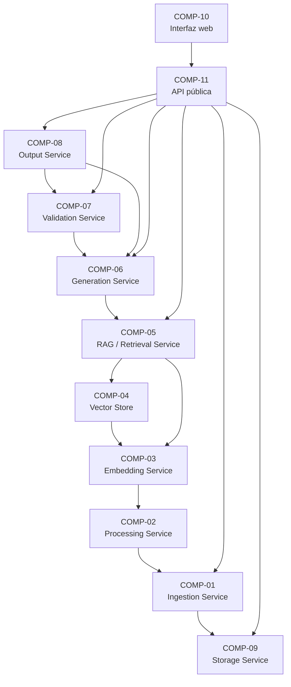

# Componentes

## Diagrama

## Detalle
| ID | Nombre | Tipo | Tecnología | Responsabilidad |
|---|---|---|---|---|
| `COMP-01` | Ingestion Service | Backend | Python, PyPDF, parsers MD/TXT | Recibir archivo, detectar tipo, extraer texto, normalizar y validar tamaño/formato |
| `COMP-02` | Processing Service | Backend | LangChain RecursiveCharacterTextSplitter | Limpieza de texto y chunking con metadata de posición/sección |
| `COMP-03` | Embedding Service | Backend / IA | EmbeddingProvider + Gemini (pendiente) + mock | Generar vectores para cada chunk vía proveedor configurable |
| `COMP-04` | Vector Store | Persistencia | ChromaDB embebido | Persistir embeddings + metadata y realizar búsqueda semántica |
| `COMP-05` | RAG / Retrieval Service | Backend | Python | Construir query desde perfil/nicho, recuperar top-k y ensamblar contexto |
| `COMP-06` | Generation Service | Backend / IA | LLMProvider + Gemini (pendiente) | Adaptar contenido por perfil/formato/nicho/nivel de detalle |
| `COMP-07` | Validation Service | Backend / IA | LLM juez + agregación determinista | Extraer claims, contrastarlos con la fuente y calcular score de fidelidad |
| `COMP-08` | Output Service | Backend | Pydantic v2 | Ensamblar el JSON final según schema formal (NuevaMenteOutput) |
| `COMP-09` | Storage Service | Cloud | OCI SDK (Object Storage Always Free) | Upload/download de originales y resultados, naming y verificación |
| `COMP-10` | Interfaz web | Frontend | Streamlit | Permitir a un usuario no técnico ejecutar todo el flujo |
| `COMP-11` | API pública | Backend | FastAPI + Pydantic | Exponer el monolito vía REST y orquestar COMP-01..COMP-09 |
